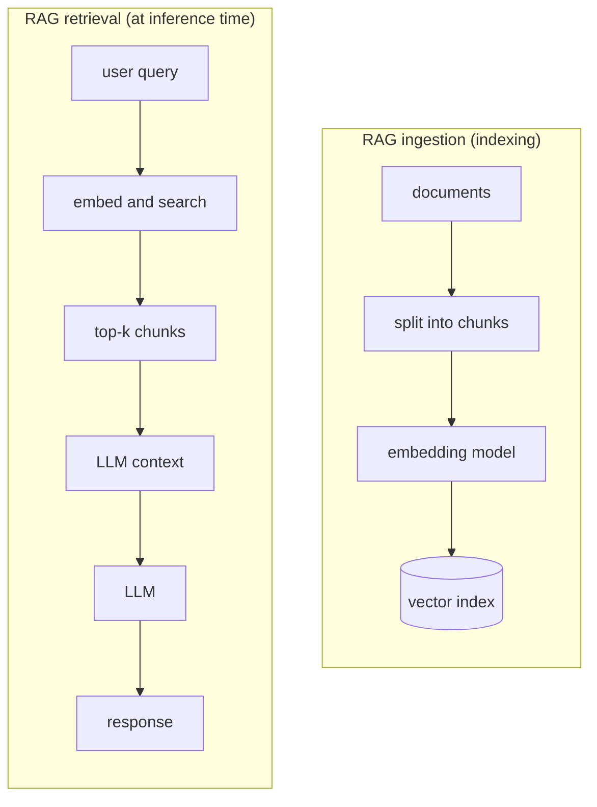
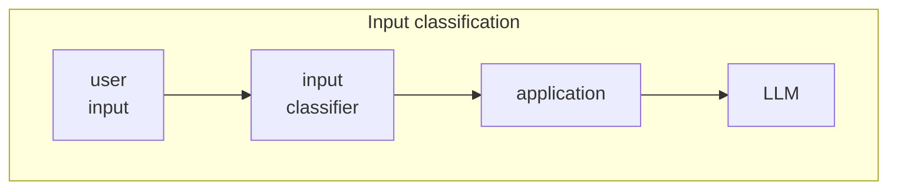
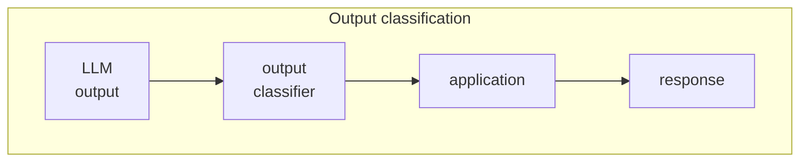
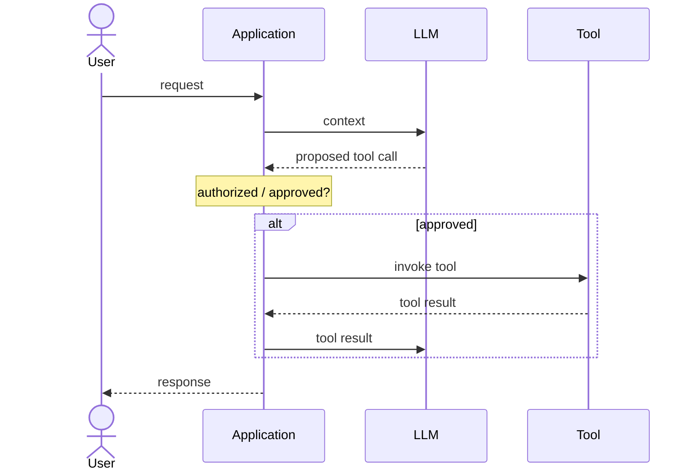
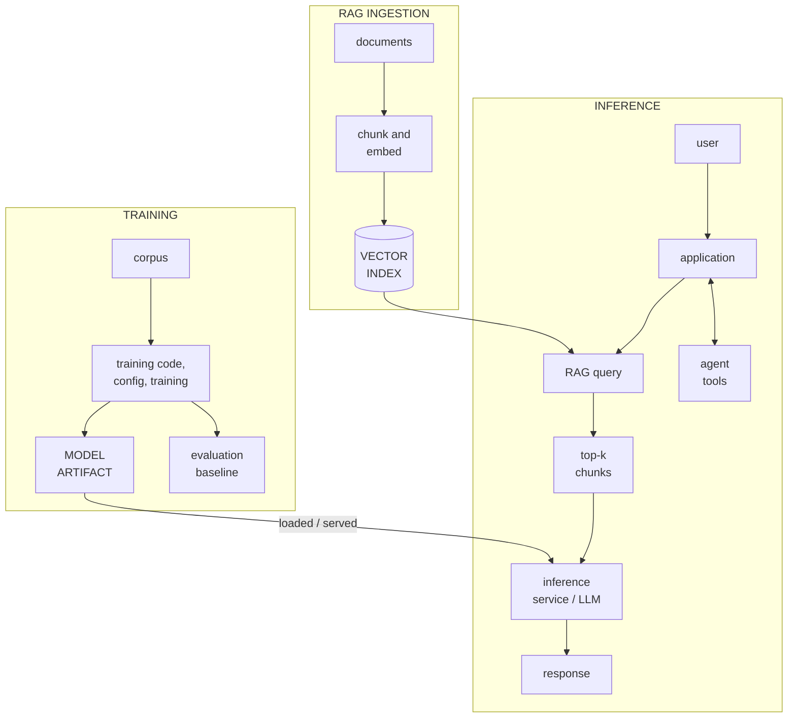

# 1. Foundations: AI/ML

## Models, training, and inference

A model combines an architecture with learned parameters, commonly called weights. The architecture defines the structure and computations that turn inputs into outputs; software implements that architecture and the surrounding runtime. The weights are numeric values learned from data that shape the model's behavior. Training creates or changes those weights. Inference runs the trained model on new input to produce an output.

Training and inference are separate phases. This section explains how the pieces work; later sections apply the security concepts to training data, model artifacts, runtime context, and surrounding services.

### How training works

Training repeatedly exposes a model to a training corpus—the collection of data used to train it—and adjusts the weights so the model better satisfies its training objective. For this guide, the key point is that the resulting behavior depends heavily on the corpus, training process, and starting model. Section 6 shows how poisoning a training corpus can intentionally alter learned behavior.

## Large language models (LLMs)

A large language model (LLM) is a model trained to process and generate language. Generative LLMs produce text by repeatedly predicting likely next tokens from the context available to them. The exact output can also depend on decoding settings that choose among plausible tokens.

### Tokens and context

LLMs process tokens rather than raw words. A token is a unit produced by a tokenizer and may be a whole word, part of a word, punctuation, or another text fragment. The model converts tokens into internal numeric representations and processes relationships across the sequence using transformer layers.

The context window is the finite amount of information available to the model for one inference. An application may place several kinds of content into that context: a system prompt containing application-level instructions, developer instructions, user input, conversation history, retrieved documents, and tool results. Section 4 shows how attacker-controlled content in that context can become prompt injection.

## Retrieval-Augmented Generation (RAG)

Retrieval-Augmented Generation (RAG) gives an LLM access to external knowledge at inference time instead of relying only on information learned into its weights. A retrieval system searches a knowledge source for material relevant to a query and supplies selected content for the application to include in the LLM context.

Top-k means the retrieval system returns the k highest-ranked matches—for example, the five most similar chunks when k=5. A document does not need to rank first to influence the model; it only needs to make the returned set. Section 6 returns to this point when discussing RAG corpus poisoning.

### Embeddings and vector search

Many RAG systems use embeddings for retrieval. An embedding model converts text into a vector—a list of numbers that captures useful semantic relationships. Vector search compares those vectors so text with similar meaning can be found even when the wording differs.

Long documents are usually divided into chunks before embedding. A chunk is much larger than a token: commonly a paragraph, several paragraphs, or a few hundred tokens, depending on the application. Stored chunks can be associated with metadata such as source, owner, tenant, classification, date, or access-control attributes. Section 8 shows how that metadata can help restrict retrieval to records the requester is authorized to read.

## Classifiers

A classifier is a model that assigns an input to one or more categories, often with confidence scores. Examples include spam detection, malware classification, image classification, and AI-security classifiers that look for prompt injection, unsafe content, or sensitive information.

AI applications often use smaller classifiers around a larger LLM because they can run faster and at lower cost. Useful? Absolutely. Infallible? No. Classification boundaries can be uncertain, inputs can fall outside the detector's training distribution, and attackers can deliberately search for evasive inputs. Section 8 covers classifiers as guardrails; Section 9 covers bypass techniques.

## Agents and tools

An agentic AI system allows a model to do more than return text. The application exposes tools—such as search, email, files, databases, APIs, or code execution—and the model can propose which tool to call and with what arguments. Application code then decides whether to execute the action and may return the result to the model for another step.

Tool use turns model output into actions with real consequences. This is where "the model said something weird" can become "the model did something weird." Section 8 covers the controls that should sit between a model proposal and actual authority.

## Fine-tuning, adapters, and derived models

A pretrained base model can be customized for a narrower task or behavior through fine-tuning. Full fine-tuning updates many or all of the model's weights. Parameter-efficient methods instead learn a much smaller set of additional weights.

LoRA (Low-Rank Adaptation) is a common parameter-efficient technique. It produces adapter weights that are loaded alongside a base model or merged into it. Adapters make customization cheaper and easier to distribute, but they can materially change behavior. A base model plus an adapter is therefore a derived model whose behavior depends on both. Section 5 returns to adapters as part of model-artifact supply-chain risk.

## Evaluation and baselines

Evaluation asks a basic question: does the model or AI system behave as expected for its intended use? Tests can cover task quality, robustness, privacy, refusal behavior, tool-use correctness, response time, cost, and security-relevant behavior. Evaluation also establishes a baseline: a repeatable description of expected behavior under known inputs.

Section 8 returns to this baseline for behavioral testing. Run baseline tests after model, artifact, prompt, or data changes—and periodically when nothing is supposed to have changed. Unexpected drift can reveal poisoned data or retrieval content, compromised artifacts, provider-side changes, configuration changes, or other attacks and failures that static inventory alone cannot detect.

## How the pieces fit together

Training, RAG ingestion, and inference are distinct processes that meet at runtime. Training produces the model that an inference service later loads or serves. RAG ingestion prepares an external knowledge source that can be searched at inference time.

### Artifacts across the lifecycle

An artifact is a stored product created or packaged during AI/ML development and deployment. The diagram above names the major places these artifacts originate; the table below maps supporting artifacts to those same processes.

| Artifact | Where it comes from / where it fits |
| --- | --- |
| Training corpus | Input to the TRAINING process. |
| Training code and configuration | Controls the TRAINING process and how the corpus is processed. |
| Checkpoint / model artifact | Produced during or after TRAINING; selected artifacts are later loaded or served for INFERENCE. |
| Base-model and adapter weights | Contained in or combined to form the MODEL ARTIFACT; adapters modify the behavior of a base model. |
| Evaluation baseline | Produced by EVALUATION of the trained model or complete system. |
| Embedding model | Used during RAG INGESTION and usually again when embedding a query for RAG retrieval. |
| Vector index | Produced by RAG INGESTION and searched during INFERENCE. |
| Package/dependency manifest and container image | Package the code and runtime used for TRAINING, RAG services, or INFERENCE. |
| Provenance records | Track lineage and versions across training, RAG ingestion, packaging, storage, and deployment. |
