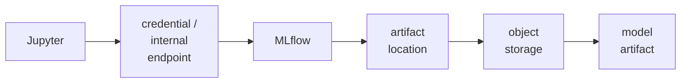

# 3. AI/ML System Recon

Recon maps the services and interfaces exposed by an AI/ML environment. Attackers and penetration testers use network and application clues to identify what is running, then enumerate what those services expose. The same map shows defenders and AI/ML practitioners which development and runtime services need authentication, network restrictions, and hardening.

## What recon looks for

A typical sequence is host/port discovery, service fingerprinting, then service-specific enumeration. A port is a numbered network endpoint; an HTTP or API endpoint is a path exposed by a service; headers, error messages, and response bodies can reveal product names, versions, models, or internal paths. The table connects common AI/ML services to their role in the architecture and the clues an attacker may use to identify them.

| Service / role | Typical clues | What exposure may reveal |
| --- | --- | --- |
| Jupyter - interactive notebooks used for development and experiments | Often TCP 8888 Jupyter login or notebook page Routes and responses identifying Jupyter | Notebook files, source code, credentials, internal endpoints, files, and—if an unauthenticated or weakly protected kernel is reachable—the ability to execute Python with the notebook server process's permissions. |
| MLflow - experiment tracking and model registry | Often TCP 5000 MLflow web/API responses Experiment/run/model endpoints | Experiments, runs, model versions, parameters, tags, metrics, users, and artifact-storage locations. |
| MinIO / S3-compatible storage - stores datasets and model artifacts | MinIO often TCP 9000 S3-compatible API responses Bucket/object listings when exposed | Datasets, model files, logs, checkpoints, and other artifacts. |
| Qdrant / Milvus - vector databases used by RAG | Qdrant often 6333 Milvus often 19530 Collection/search API responses | Collections, vector metadata, document references, tenant or access-control metadata, and sometimes retrievable content. |
| NVIDIA Triton / TensorFlow Serving / TorchServe - model inference servers | Triton commonly 8000/8001/8002 TensorFlow Serving commonly 8500/8501 TorchServe commonly 8080/8081/8082 Health, metadata, or model-management endpoints | Served model names and versions, health/readiness, input/output metadata, runtime configuration, and potentially management capabilities. |
| Ray Dashboard - distributed compute / job orchestration | Often TCP 8265 Dashboard/API responses | Jobs, workers, resources, logs, and distributed-compute metadata. |
| Ollama - local model serving | Often TCP 11434 Local inference/model-list API | Available local models and inference capability. |
| Prometheus - monitoring/metrics | Often TCP 9090 Metrics endpoints and labels | Model/version names, request rates, response times, hardware/resource information, and internal service labels. |

Enumeration is product-specific. For example, a tester might query a model server's health and metadata endpoints to learn which models are served, inspect MLflow experiment/model APIs for artifact locations, or list accessible object-storage buckets. Do not memorize a heap of endpoints. The useful skill is recognizing that exposed management and metadata interfaces can reveal the next step in an attack path.

> **Jupyter warning:** An exposed Jupyter environment deserves particular attention: notebooks are designed to run code. If an attacker can reach an unprotected kernel, arbitrary Python execution is essentially a built-in feature, not an exotic exploit. From there, the attacker may read files and environment variables, steal cloud credentials, modify notebooks or artifacts, or pivot to other services using the notebook process's permissions. Section 5 covers the related supply-chain consequences.

## Chaining findings

Small disclosures become bigger problems when they connect components. A notebook may reveal an internal MLflow URL or credential; MLflow may reveal an object-storage location; that storage may contain a model artifact.

