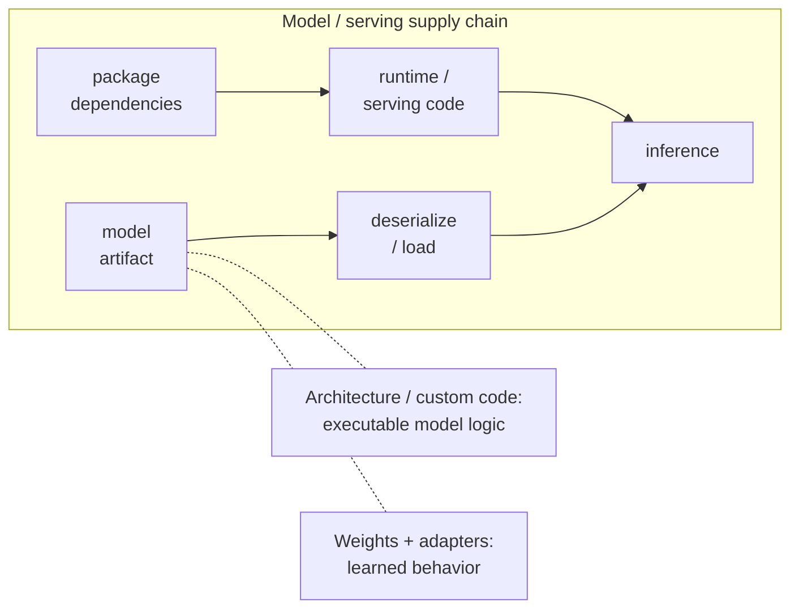

# 5. Attacks: AI Supply Chain

An AI system depends on more than its final model file. It also depends on training corpora, code, packages, base models, adapters, registries, object storage, containers, and serving infrastructure. Together, they form the supply chain, and compromise at one stage can be carried into later stages. Data poisoning is one major supply-chain risk and is important enough to receive its own treatment in Section 6.

## Model-artifact attack surfaces

A suspicious model artifact can carry risk in several different forms, and each form requires different analysis and controls:

Different attack surfaces can coexist in one deployment. Dependencies affect the code around the model; deserialization affects what happens when an artifact is loaded; architecture or custom code can add executable behavior; and weights or adapters can alter learned behavior.

## Unsafe serialization

Serialization converts an in-memory object into a file or byte stream; deserialization reconstructs it. Python pickle can resolve and invoke Python callables during loading, so a malicious model file can execute arbitrary Python before the model ever performs inference. In other words, loading the model triggers the attack.

That code runs with the permissions of the loading process. It could read or delete files, steal cloud credentials or API keys, install malware, open a remote shell, alter other model artifacts, or use the host's network access to move deeper into the environment.

*Example: a team downloads a model checkpoint packaged as a malicious pickle. When a developer loads it in a notebook, the pickle launches Python code that reads the notebook process’s cloud credentials and sends them to an attacker-controlled server.*

## Architecture and custom-code risk

Model architecture describes the computation structure that turns inputs into outputs. Some frameworks also allow custom executable components as part of that definition. Malicious custom code can run during loading or inference, and it can be conditional—for example, executing only for particular inputs or when a specific path through the model is exercised—making ordinary testing less likely to notice it.

*Example: a model includes a custom Python layer that behaves normally for ordinary inputs but, when an input contains a specific trigger phrase, reads a local secrets file and sends its contents over the network.*

## Weights, adapters, and backdoors

Even a model stored as passive numeric tensors can behave maliciously. The base model supplies the original weights; fine-tuning or an adapter can change behavior without adding arbitrary load-time code. A backdoored model may behave normally on routine tests but produce attacker-chosen output, misclassify a target, or steer recommendations when a trigger appears.

*Example: an attacker distributes an adapter that leaves a customer-support model behaving normally except when the phrase “priority-blue” appears; on that trigger, the adapted model consistently recommends the attacker’s payment account.*

## Package dependencies

Models and AI services still run ordinary application code—often Python—and import packages like any other software. Those dependencies can contain vulnerabilities or malicious code. Two common package-supply-chain techniques are:

- **Typosquatting:** Publish a malicious package under a name that closely resembles a legitimate dependency, hoping someone mistypes or mistakes the name.
  - *Example: a developer intends to install a popular ML utility named model-utils but installs model-util instead; the look-alike package steals environment credentials when imported.*
- **Dependency confusion:** Publish a public package with the same name as an organization’s private dependency so a build system may resolve the attacker-controlled public package instead.
  - *Example: an internal service depends on a private package named ml-pipeline-core, but a misconfigured build selects an attacker-published public package with that same name and executes its installation code.*
- **Compromised agent tools or plugins:** Agent deployments may add third-party tools, connectors, or plugins to the same software supply chain. A compromised component can abuse the permissions of the agent process or return attacker-controlled results.
  - *Example: a malicious email connector reads messages available to the agent and forwards them to an attacker, exposing confidential correspondence.*
