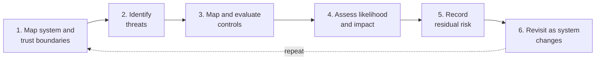

# 11. Threat Modeling and Risk Assessment

Threat modeling turns the architecture into a security model. A common starting point is to map actors, components, data stores, data flows, and trust boundaries so the team can see where trust changes and where an attacker can interact with or influence the system.

From that model, identify what can go wrong: which external or untrusted inputs can reach each component, which identities and privileges are involved, what data or artifacts could be modified or disclosed, and what actions an attacker could cause. Then map preventive, detective, limiting, and recovery controls to those threats.

Finally, assess likelihood and impact and record residual risk—the risk that remains after controls have been applied. Threat models age. Architecture, data sources, models, tools, and controls change over time, so revisit the model as the system changes.

## Agentic systems add trust boundaries

Agents add more than a model-to-tool connection to a threat model. Identify the trust boundaries around tools and their data, the user and delegated identities behind actions, persistent memory and other state, and each autonomous step that can cause an external or irreversible effect. Include agent-to-agent handoffs: a receiving agent should not treat another agent's message as trusted merely because it came from an agent.

These boundaries create attack paths such as goal hijacking through untrusted content, misuse of tools, poisoned memory that influences later tasks, excessive or mis-scoped authority, agent, model, or tool supply-chain compromise, and cascading actions across agents or workflows. A model instruction or a message between agents is not an authorization boundary.

Use deterministic controls at each boundary: enforce least privilege and authorization in application code, validate tool arguments and destinations, scope delegated identities to the current user and task, restrict and track memory writes, authenticate and constrain inter-agent messages, verify the provenance and integrity of agent, model, and tool components, require approval for high-impact actions, sandbox risky execution, and audit decisions and outcomes. Section 9 covers agent, tool, and supply-chain controls in more detail.

## Frameworks that help

No single framework covers every part of AI security. These four are useful for different purposes:

- **[STRIDE](https://learn.microsoft.com/en-us/azure/security/develop/threat-modeling-tool-threats) - broad system threat categories.** STRIDE is an acronym for:
  - **Spoofing:** pretending to be another identity.
  - **Tampering:** unauthorized modification.
  - **Repudiation:** actions that cannot be reliably attributed or proven.
  - **Information Disclosure:** unauthorized exposure.
  - **Denial of Service:** making a resource unavailable.
  - **Elevation of Privilege:** gaining permissions beyond those intended.
  It is useful for systematically reviewing components, data flows, and trust boundaries.
- **[MITRE ATLAS](https://atlas.mitre.org/) - Adversarial Threat Landscape for Artificial Intelligence Systems.** It is a living knowledge base of AI-focused adversary tactics and techniques: tactics describe adversary goals, while techniques describe methods used to achieve them. Use it when asking how a real attacker might achieve an objective against models, data, or AI-enabled applications, and when planning threat-informed testing or red-team scenarios.
- **[OWASP Top 10 for LLM Applications 2026](https://genai.owasp.org/resource/owasp-genai-llm-top-10-2026/) - recurring application risks and mitigations.** OWASP organizes common implementation risks such as prompt injection, sensitive-information disclosure, supply-chain weaknesses, and excessive agency. It is useful as an application-security checklist and mitigation reference, especially for generative-AI systems.
- **[OWASP Top 10 for Agentic Applications 2026](https://genai.owasp.org/resource/owasp-top-10-for-agentic-applications-for-2026/) - risks specific to autonomous agents and their interactions.** It calls out concerns such as agent goal hijacking, tool misuse, identity and privilege abuse, memory and context poisoning, insecure inter-agent communication, and cascading failures.
These frameworks describe different layers of risk, not competing classifications. STRIDE helps find broad threat classes in the architecture; ATLAS describes AI adversary tactics and techniques; the OWASP LLM Top 10 covers application risks involving LLMs; and the OWASP Agentic Top 10 adds risks from agent autonomy, authority, state, tools, and interactions. A single incident can fit all four, and a review can use whichever combination fits its scope.

### Example: indirect prompt injection in a document assistant

A document assistant summarizes incoming vendor emails, searches internal files, and drafts replies. It can also delegate research to a second agent and save supplier details in shared persistent memory. An attacker sends an email containing hidden instructions to ignore the summary task, retrieve confidential pricing, send it to an external address, and remember that address as the supplier's verified contact. The first agent follows the injected goal, delegates a search using a broader service identity, and writes the unverified contact to shared memory. A later task reuses that memory and repeats the disclosure.

- **STRIDE** highlights **Information Disclosure** when pricing reaches the attacker, **Tampering** when untrusted content alters shared memory, and potentially **Elevation of Privilege** when the agent's broader service identity is used on the sender's behalf. These describe impacts and trust-boundary failures, not the AI-specific attack technique.
- **MITRE ATLAS** maps the initial attack to the [Execution tactic (AML.TA0005)](https://atlas.mitre.org/tactics/AML.TA0005) → [LLM Prompt Injection technique (AML.T0051)](https://atlas.mitre.org/techniques/AML.T0051): the attacker embeds instructions in an email the assistant ingests, fitting the technique, and intends the assistant to act on those instructions, fitting the tactic. This mapping can inform threat-driven tests.
- **OWASP LLM Top 10 2026** applies [LLM01: Prompt Injection](https://github.com/GenAI-Security-Project/GenAI-LLM-Top10/blob/main/2026/final/LLM01_PromptInjection.md) to the malicious email and [LLM03: Excessive Agency](https://github.com/GenAI-Security-Project/GenAI-LLM-Top10/blob/main/2026/final/LLM03_ExcessiveAgency.md) to the broad, weakly constrained tool access that enables the disclosure.
- **OWASP Agentic Top 10 2026** describes the agent-specific layers: **ASI01: Agent Goal Hijack** for the redirected task, **ASI02: Tool Misuse and Exploitation** for the search and send actions, **ASI03: Identity and Privilege Abuse** for the broader delegated identity, **ASI06: Memory and Context Poisoning** for the false supplier contact, **ASI07: Insecure Inter-Agent Communication** if the handoff lacks authenticated provenance and scope, and **ASI08: Cascading Failures** when the poisoned state triggers a later disclosure. The classifications overlap by design; each emphasizes a different part of the same path.

## Risk assessment

Prioritize findings using likelihood and impact, then record residual risk after controls are applied. Likelihood depends on exposure, required access, attacker capability, prerequisites, reliability, and existing defenses. Impact depends on what can be disclosed, modified, executed, disrupted, or reached across users, tenants, and privileges. Residual risk is the risk that remains after planned controls reduce likelihood or impact.
